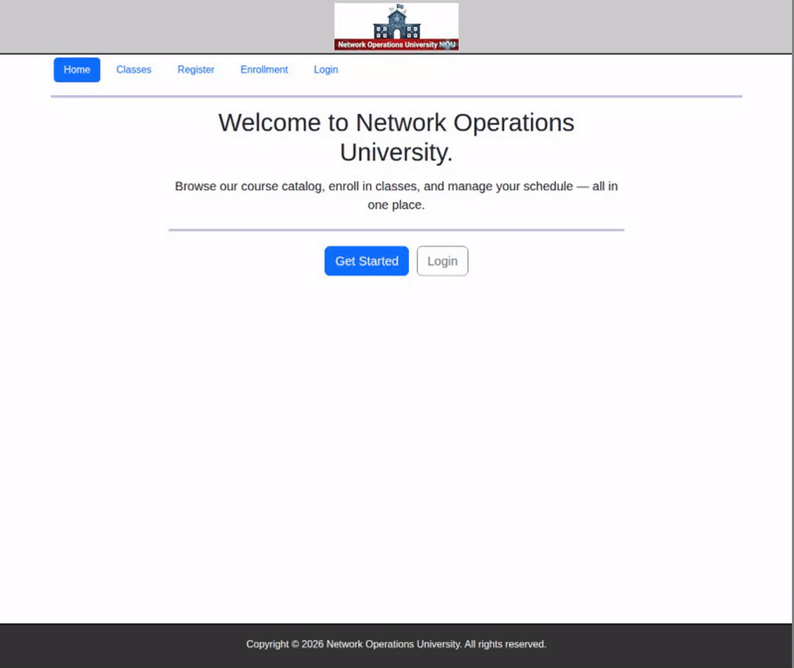

# Course Enrollment App

[](https://github.com/robert-7/Course-Enrollment-App/actions/workflows/main.yml)
[](https://codecov.io/gh/robert-7/Course-Enrollment-App)


A full-stack Flask web application for course enrollment with user
authentication, MongoDB-backed data models, REST APIs with Swagger docs,
and a fully containerized Docker Compose setup.



## Quick Start

Make sure [Docker](https://docs.docker.com/get-docker/) is installed, then run:

```bash
make run
```

The app will be available at [http://localhost:5000](http://localhost:5000). The Swagger API docs are at [http://localhost:5000/api/docs](http://localhost:5000/api/docs).

To tear everything down:

```bash
make clean
```

Other useful commands:

| Command | Description |
|---------|-------------|
| `make run` | Build and start all containers |
| `make test` | Run the test suite inside the Flask container |
| `make seed` | Re-seed the database with course data |
| `make lint` | Run linters via pre-commit |
| `make clean` | Tear down containers and volumes |

## Contributing

See [CONTRIBUTING.md](CONTRIBUTING.md) for environment setup, linting, Postman, and other developer instructions.

## E2E Testing (Playwright)

This repo includes an automated UI walkthrough test:
[e2e/ui-walkthrough.spec.js](e2e/ui-walkthrough.spec.js).

Quick run (Docker-only, no local npm install needed):

```bash
docker compose up -d --build
docker compose run --rm e2e-tests
```

Equivalent Make command:

```bash
make e2e-docker
```

Local Playwright run (if you want to run from host machine):

```bash
npm install
npx playwright install chromium
docker compose up -d --build
npm run e2e:walkthrough
```

For full details, see [TESTING.md](TESTING.md).

## Features

- **User registration & login** — session-based auth with hashed passwords (Werkzeug)
- **Course catalog** — browse courses pulled from MongoDB, filterable by term
- **Course enrollment** — enroll in courses with duplicate-enrollment protection
- **Enrollment dashboard** — view your enrolled courses via MongoDB aggregation
- **REST API** — full CRUD for users at `/api` with Swagger UI docs (flask-restx)
- **Dockerized stack** — Flask, MongoDB, and seed data orchestrated via Docker Compose
- **CI/CD** — GitHub Actions workflows with pre-commit linting (flake8, markdownlint)

Please see [the testing documentation](TESTING.md) that showcases an end-to-end demo of features supported.

## Architecture

The app runs as three Docker Compose services:

| Service | Description |
|---------|-------------|
| **course-enrollment-app** | Python/Flask web server on port 5000 |
| **mongodb** | MongoDB 8.2 database with persistent volume |
| **mongo-seed** | One-shot container that imports course data on first run |

```plaintext
Browser :5000 ──► course-enrollment-app ──► mongodb :27017
                                   ▲
                              mongo-seed
                          (imports courses.json)
```

The Flask app follows a single-module structure under [`application/`](application/README.md).

## Acknowledgments

This project was originally based on the LinkedIn Learning course
["Full Stack Web Development with Flask"](https://www.linkedin.com/learning/full-stack-web-development-with-flask).
It has since been extended with Docker containerization, CI/CD pipelines,
rebranded course data, and additional tooling.
