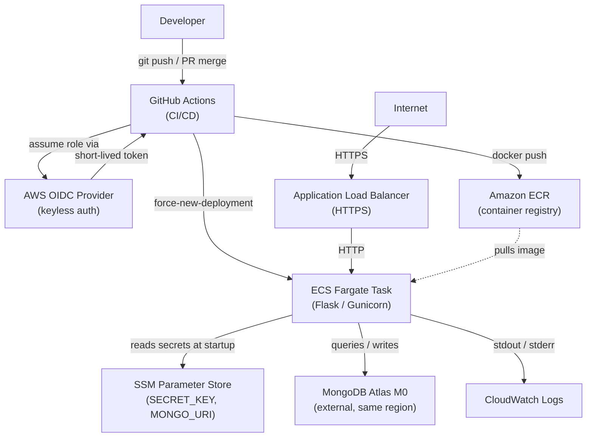

# AWS Architecture — Course Enrollment App

This document is the single source of truth for the AWS deployment design of the Course Enrollment App.
It captures architecture decisions, the system diagram, cost estimates, and the release strategy.

---

## Architecture Decision Records

### ADR-001: Container Orchestration — ECS Fargate

| | |
|---|---|
| **Decision** | ECS Fargate |
| **Alternatives considered** | EC2, EKS, App Runner |
| **Rationale** | Serverless containers — no EC2 patching, scales to zero when desired count is set to 0 (ideal for demo/cost control), and is the cheapest managed container option at this scale. |

---

### ADR-002: Database — MongoDB Atlas M0

| | |
|---|---|
| **Decision** | MongoDB Atlas M0 (free cluster) |
| **Alternatives considered** | AWS DocumentDB, self-hosted MongoDB on EC2 |
| **Rationale** | Free tier eliminates database cost entirely. Fully compatible with MongoEngine (the ORM already used by the app), so no application rewrite is required. |

---

### ADR-003: Secrets Management — SSM Parameter Store

| | |
|---|---|
| **Decision** | AWS SSM Parameter Store (Standard tier) |
| **Alternatives considered** | AWS Secrets Manager, environment variables embedded in the ECS task definition |
| **Rationale** | Standard-tier parameters are free, versus Secrets Manager at $0.40/secret/month. Embedding secrets in the task definition is insecure and harder to rotate. SSM is adequate for this scale. |

---

### ADR-004: GitHub → AWS Authentication — OIDC (Keyless)

| | |
|---|---|
| **Decision** | GitHub Actions OIDC federation (keyless) |
| **Alternatives considered** | IAM access keys stored as GitHub Secrets |
| **Rationale** | No long-lived credentials to rotate or leak. GitHub-native support makes configuration straightforward. Follows AWS and GitHub best-practice guidance for CI/CD authentication. |

---

### ADR-005: Infrastructure as Code — AWS CDK (Python)

| | |
|---|---|
| **Decision** | AWS CDK (Python) |
| **Alternatives considered** | Terraform, CloudFormation (raw YAML/JSON), AWS SAM |
| **Rationale** | Same language as the application, so contributors need only one language. CDK provides high-level constructs that reduce boilerplate compared to raw CloudFormation, and `cdk destroy` makes teardown straightforward. |

---

### ADR-006: Load Balancer — Application Load Balancer (ALB)

| | |
|---|---|
| **Decision** | Application Load Balancer (ALB) |
| **Alternatives considered** | Network Load Balancer (NLB), CloudFront |
| **Rationale** | ALB provides HTTP/HTTPS routing and integrates natively with ECS service discovery. It is covered by the AWS free tier for the first 12 months (750 hours/month). CloudFront is unnecessary overhead for an internal/demo app. |

---

## Architecture Diagram

---

## Cost Estimate

> All prices are approximate US East (us-east-1) on-demand rates as of 2026.

| Service | Configuration | Est. monthly cost |
|---|---|---|
| ECS Fargate | 0.25 vCPU / 0.5 GB RAM, running 24/7 | ~$10 |
| ALB | Free tier: 750 hrs/month for first 12 months | $0 → ~$16 |
| ECR | Free tier: 500 MB storage | $0 |
| SSM Parameter Store | Standard tier | $0 |
| MongoDB Atlas | M0 free cluster | $0 |
| CloudWatch Logs | Free tier: 5 GB ingestion/month | $0 |
| **Total** | | **~$10–26/month** |

> **Cost-saving tip:** Set ECS desired count to `0` when not demoing.
> This reduces the Fargate charge to ~$0, bringing the total monthly cost to near $0 while retaining all infrastructure.

---

## Release Strategy and Versioning

### Versioning scheme

The project follows [Semantic Versioning](https://semver.org/) (`MAJOR.MINOR.PATCH`):

| Component | When to increment |
|---|---|
| `MAJOR` | Breaking changes to the API or data model |
| `MINOR` | New features added in a backwards-compatible manner |
| `PATCH` | Backwards-compatible bug fixes |

The current AWS deployment milestone is **v2.0.0**.

### Release process

1. **Feature branch** — all work is done on a branch off `main`.
1. **Pull request** — PR is opened; CI runs linting, unit tests, and Playwright e2e tests.
1. **Merge to `main`** — triggers the CD pipeline:
   - Docker image is built and pushed to ECR, tagged with the Git SHA and the semantic version tag (e.g., `v2.1.0`).
   - ECS service is updated via `force-new-deployment`; the old task is drained gracefully by the ALB.
1. **GitHub Release** — a GitHub Release is created from the version tag, auto-generating a changelog from merged PRs.

### Docker image tagging convention

| Tag | Purpose |
|---|---|
| `latest` | Most recent build from `main` |
| `<git-sha>` | Immutable reference to an exact commit |
| `v<MAJOR.MINOR.PATCH>` | Stable release tag for rollbacks |

### Rollback procedure

To revert a bad deployment, re-tag a previous ECR image as `latest` and trigger a new ECS force-deployment,
or use the ECS console to point the service at a prior task definition revision.
